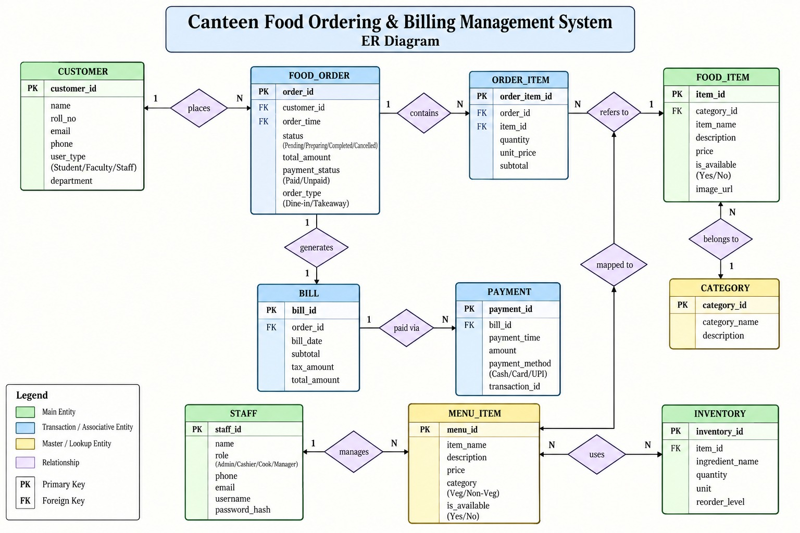
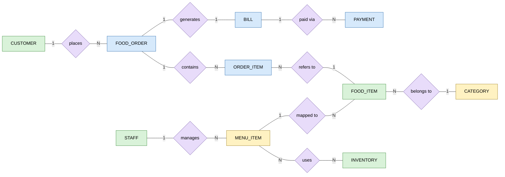
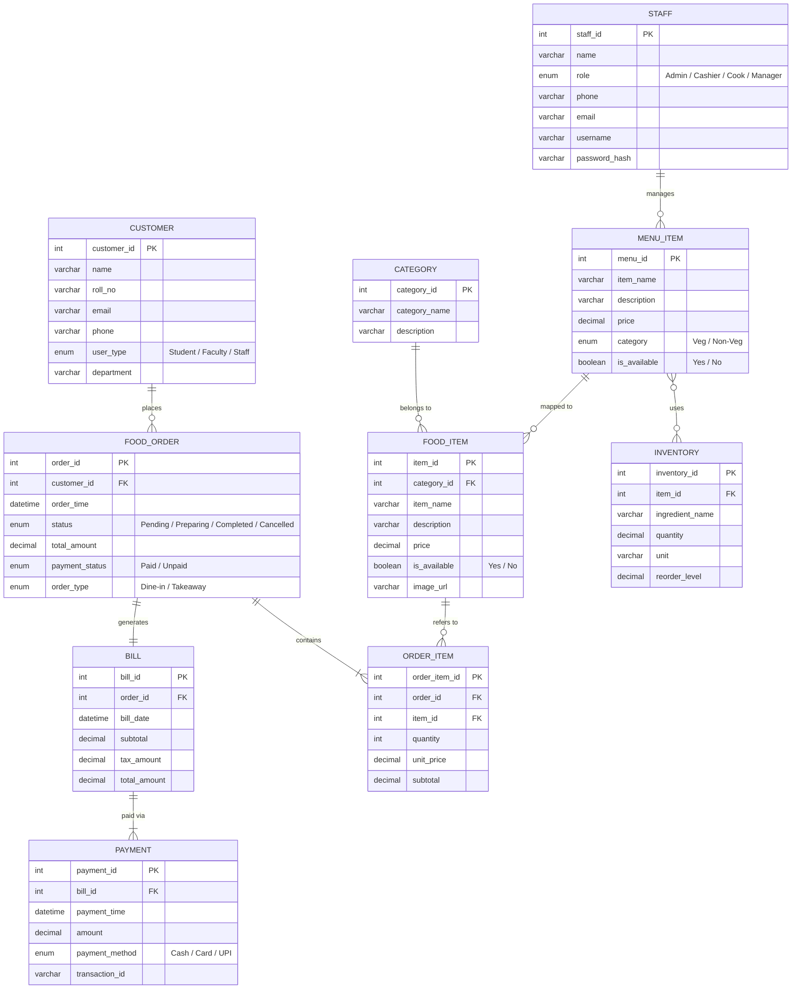
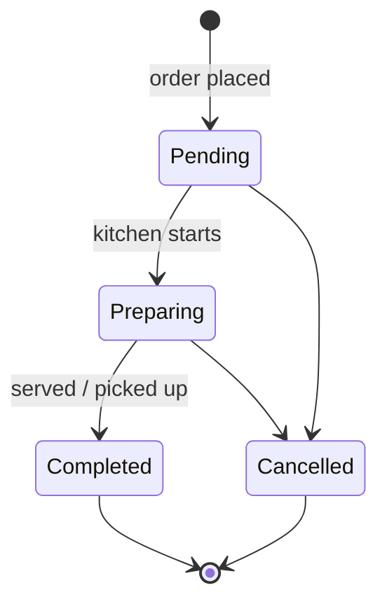

# ER Diagram — Canteen Food Ordering & Billing Management System

> Put the ER diagram image next to this file as `er-diagram.jpg` so it shows above on GitHub. The diagrams below are the same model in [Mermaid](https://mermaid.js.org/), which GitHub renders automatically.

---

## 1. Entities

| # | Entity | Type | Primary key | Attributes |
|---|--------|------|-------------|------------|
| 1 | CUSTOMER | Main | customer_id | name, roll_no, email, phone, user_type (Student/Faculty/Staff), department |
| 2 | FOOD_ORDER | Transaction | order_id | customer_id (FK), order_time, status (Pending/Preparing/Completed/Cancelled), total_amount, payment_status (Paid/Unpaid), order_type (Dine-in/Takeaway) |
| 3 | ORDER_ITEM | Transaction / Associative | order_item_id | order_id (FK), item_id (FK), quantity, unit_price, subtotal |
| 4 | FOOD_ITEM | Main | item_id | category_id (FK), item_name, description, price, is_available (Yes/No), image_url |
| 5 | CATEGORY | Master / Lookup | category_id | category_name, description |
| 6 | BILL | Transaction | bill_id | order_id (FK), bill_date, subtotal, tax_amount, total_amount |
| 7 | PAYMENT | Transaction | payment_id | bill_id (FK), payment_time, amount, payment_method (Cash/Card/UPI), transaction_id |
| 8 | STAFF | Main | staff_id | name, role (Admin/Cashier/Cook/Manager), phone, email, username, password_hash |
| 9 | MENU_ITEM | Master / Lookup | menu_id | item_name, description, price, category (Veg/Non-Veg), is_available (Yes/No) |
| 10 | INVENTORY | Main | inventory_id | item_id (FK), ingredient_name, quantity, unit, reorder_level |

## 2. Relationships

| Relationship | Entity A | Cardinality | Entity B | Meaning |
|--------------|----------|:-----------:|----------|---------|
| places | CUSTOMER | 1 : N | FOOD_ORDER | A customer places many orders; each order is placed by one customer |
| contains | FOOD_ORDER | 1 : N | ORDER_ITEM | An order contains one or more order lines |
| refers to | ORDER_ITEM | N : 1 | FOOD_ITEM | Each order line refers to one food item |
| belongs to | FOOD_ITEM | N : 1 | CATEGORY | Each food item belongs to one category |
| generates | FOOD_ORDER | 1 : 1 | BILL | Each order generates one bill |
| paid via | BILL | 1 : N | PAYMENT | A bill can be paid through one or more payments (e.g. a failed UPI attempt, then cash) |
| manages | STAFF | 1 : N | MENU_ITEM | A staff member manages many menu items |
| uses | MENU_ITEM | M : N | INVENTORY | A menu item uses many inventory items; an inventory item is used by many menu items |
| mapped to | MENU_ITEM | 1 : N | FOOD_ITEM | Each food item is mapped to a menu (kitchen) item *(see note 2 in section 6)* |

---

## 3. ER Diagram — Chen notation (entities, relationships, cardinalities)

Colours follow the original diagram's legend: green = main entity, blue = transaction / associative entity, yellow = master / lookup entity, purple diamond = relationship.

---

## 4. ER Diagram — Crow's-foot notation (with attributes)

**Crow's-foot legend:** `||` exactly one · `o|` zero or one · `|{` one or many · `o{` zero or many.
The original diagram gives only maximum cardinalities (1 / N). The minimums above are the natural reading: an order must have at least one line, a bill has at least one payment, a customer may have no orders yet.

---

## 5. Order Status Lifecycle (FOOD_ORDER.status)

`payment_status` moves from **Unpaid** to **Paid** when a PAYMENT for the order's BILL succeeds.

---

## 6. Notes on the ER Diagram

1. **`order_time` is labelled FK** in FOOD_ORDER, but it doesn't reference any entity. It's a normal attribute (shown that way in section 4).
2. **"mapped to" is connected to the *refers to* diamond**, not to an entity, and has no 1 / N labels. In standard ER, a relationship links entities only. It's read here as **MENU_ITEM 1 : N FOOD_ITEM**. Redraw the line to the FOOD_ITEM box and add the cardinalities.
3. **"manages" (STAFF 1 : N MENU_ITEM)** needs a `staff_id` FK in MENU_ITEM when converted to tables. The relational schema adds it.
4. **"uses" is M : N**, so it becomes a separate junction table (`MENU_ITEM_INVENTORY`) in the relational schema. The `item_id` FK drawn inside INVENTORY doesn't implement this relationship, because MENU_ITEM's key is `menu_id`.
5. **Derived attributes:** ORDER_ITEM.subtotal (= quantity × unit_price), BILL.total_amount (= subtotal + tax_amount), FOOD_ORDER.total_amount (= the bill's total) and FOOD_ORDER.payment_status (from PAYMENT) can all be calculated. In Chen notation they'd be drawn as dashed ovals. See section 7.3 of `relationalschema.md`.
