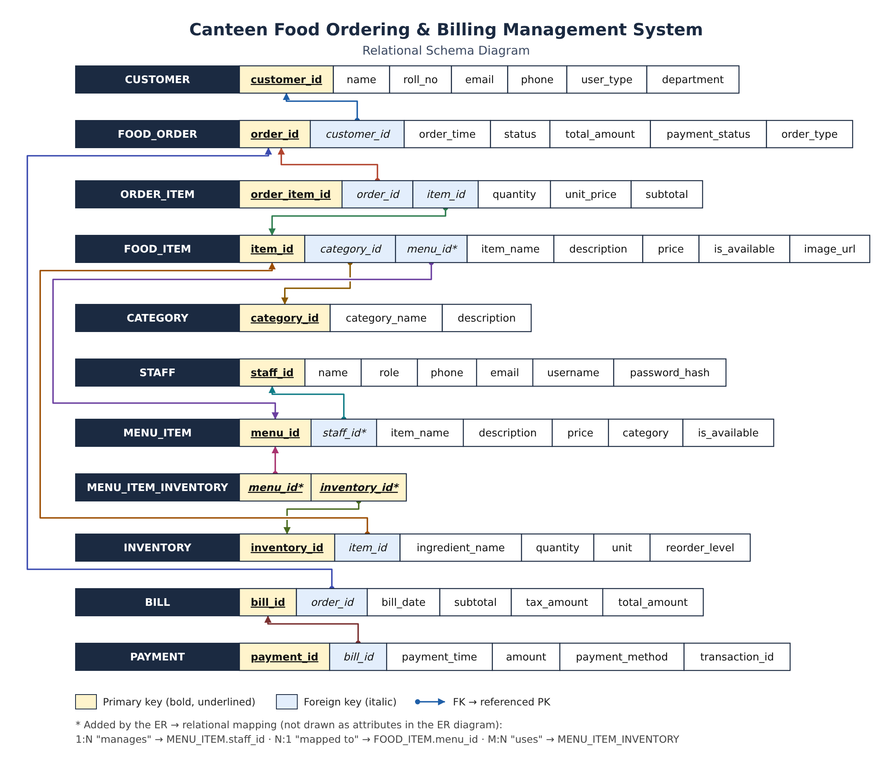
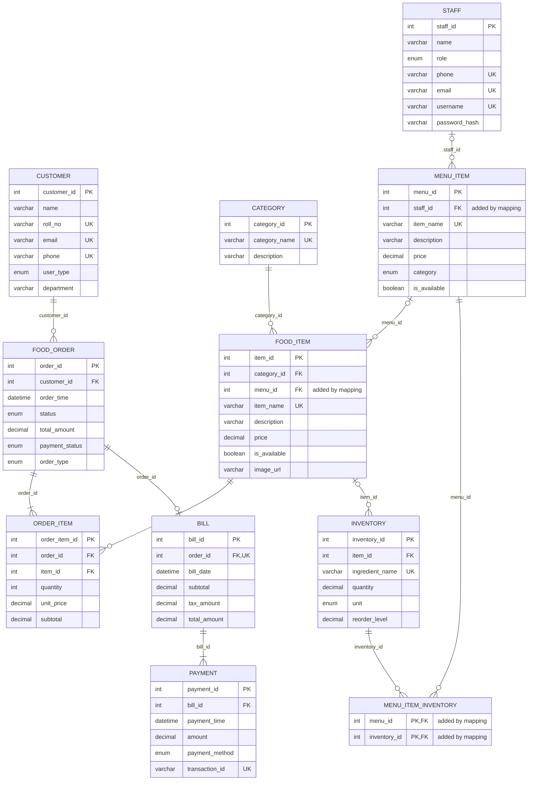

# Relational Schema — Canteen Food Ordering & Billing Management System

This schema is derived from the project **ER diagram** (CUSTOMER, FOOD_ORDER, ORDER_ITEM, FOOD_ITEM, CATEGORY, BILL, PAYMENT, STAFF, MENU_ITEM, INVENTORY) using the standard ER → relational mapping rules.

**Notation**

- **Bold + underlined** = Primary Key (PK)
- *Italic* = Foreign Key (FK) → referenced relation
- `*` = attribute/relation added by the mapping rules (implied by a relationship in the ER diagram but not drawn as an attribute)

---

## 1. Relational Schema Diagram



> Image files: `relational-schema-diagram.png` / `relational-schema-diagram.svg`. Put them next to this file so the image above shows on GitHub.

Same schema as a Mermaid diagram (GitHub renders this automatically):



---

## 2. Relational Schema (textual form)

<pre>
CUSTOMER            ( <b><u>customer_id</u></b>, name, roll_no, email, phone, user_type, department )

FOOD_ORDER          ( <b><u>order_id</u></b>, <i>customer_id</i>, order_time, status, total_amount,
                      payment_status, order_type )

ORDER_ITEM          ( <b><u>order_item_id</u></b>, <i>order_id</i>, <i>item_id</i>, quantity, unit_price, subtotal )

FOOD_ITEM           ( <b><u>item_id</u></b>, <i>category_id</i>, <i>menu_id</i>*, item_name, description, price,
                      is_available, image_url )

CATEGORY            ( <b><u>category_id</u></b>, category_name, description )

STAFF               ( <b><u>staff_id</u></b>, name, role, phone, email, username, password_hash )

MENU_ITEM           ( <b><u>menu_id</u></b>, <i>staff_id</i>*, item_name, description, price, category,
                      is_available )

MENU_ITEM_INVENTORY*( <b><u><i>menu_id</i></u></b>, <b><u><i>inventory_id</i></u></b> )

INVENTORY           ( <b><u>inventory_id</u></b>, <i>item_id</i>, ingredient_name, quantity, unit, reorder_level )

BILL                ( <b><u>bill_id</u></b>, <i>order_id</i>, bill_date, subtotal, tax_amount, total_amount )

PAYMENT             ( <b><u>payment_id</u></b>, <i>bill_id</i>, payment_time, amount, payment_method,
                      transaction_id )
</pre>

Foreign keys:

```
FOOD_ORDER.customer_id            → CUSTOMER.customer_id
ORDER_ITEM.order_id               → FOOD_ORDER.order_id
ORDER_ITEM.item_id                → FOOD_ITEM.item_id
FOOD_ITEM.category_id             → CATEGORY.category_id
FOOD_ITEM.menu_id                 → MENU_ITEM.menu_id
MENU_ITEM.staff_id                → STAFF.staff_id
MENU_ITEM_INVENTORY.menu_id       → MENU_ITEM.menu_id
MENU_ITEM_INVENTORY.inventory_id  → INVENTORY.inventory_id
INVENTORY.item_id                 → FOOD_ITEM.item_id
BILL.order_id                     → FOOD_ORDER.order_id
PAYMENT.bill_id                   → BILL.bill_id
```

---

## 3. ER → Relational Mapping Steps

| Step | Rule | Applied to | Result |
|------|------|------------|--------|
| 1 | Each strong entity → one relation; key attribute → PK | CUSTOMER, FOOD_ORDER, ORDER_ITEM, FOOD_ITEM, CATEGORY, BILL, PAYMENT, STAFF, MENU_ITEM, INVENTORY | 10 relations |
| 2 | Enumerated attributes (Student/Faculty/Staff, Paid/Unpaid, …) → domain constraint (ENUM / CHECK) | user_type, status, payment_status, order_type, role, category, payment_method, is_available | Section 4 |
| 3 | 1 : N → PK of the "1" side becomes FK on the "N" side | places, contains, refers to, belongs to, paid via | `customer_id`, `order_id`, `item_id`, `category_id`, `bill_id` |
| 4 | 1 : N "manages" (STAFF 1 : N MENU_ITEM) → FK on MENU_ITEM | manages | **`MENU_ITEM.staff_id`*** (not drawn in the ER) |
| 5 | 1 : 1 → FK on the total-participation side + UNIQUE | generates (FOOD_ORDER 1 : 1 BILL) | `BILL.order_id` UNIQUE |
| 6 | M : N → new relation whose PK is both FKs | uses (MENU_ITEM N : N INVENTORY) | **`MENU_ITEM_INVENTORY`*** |
| 7 | "mapped to" (MENU_ITEM ↔ FOOD_ITEM, see 9.2) taken as MENU_ITEM 1 : N FOOD_ITEM → FK on FOOD_ITEM | mapped to | **`FOOD_ITEM.menu_id`*** |

---

## 4. Relation Details (domains & constraints)

Data types are written for MySQL 8.

### 4.1 CUSTOMER

| Attribute | Type | Null | Key | Constraint |
|-----------|------|------|-----|------------|
| **customer_id** | INT UNSIGNED AUTO_INCREMENT | No | PK | |
| name | VARCHAR(100) | No | | |
| roll_no | VARCHAR(20) | Yes | UK | NULL for faculty/staff |
| email | VARCHAR(150) | No | UK | valid email format |
| phone | VARCHAR(15) | Yes | UK | 10–15 digits |
| user_type | ENUM('Student','Faculty','Staff') | No | | default 'Student' |
| department | VARCHAR(100) | Yes | | |

### 4.2 FOOD_ORDER

| Attribute | Type | Null | Key | Constraint |
|-----------|------|------|-----|------------|
| **order_id** | INT UNSIGNED AUTO_INCREMENT | No | PK | |
| *customer_id* | INT UNSIGNED | No | FK → CUSTOMER | ON DELETE RESTRICT |
| order_time | DATETIME | No | | default CURRENT_TIMESTAMP |
| status | ENUM('Pending','Preparing','Completed','Cancelled') | No | | default 'Pending' |
| total_amount | DECIMAL(10,2) | No | | ≥ 0 (derived, see 7.3) |
| payment_status | ENUM('Paid','Unpaid') | No | | default 'Unpaid' (derived, see 7.3) |
| order_type | ENUM('Dine-in','Takeaway') | No | | default 'Dine-in' |

### 4.3 ORDER_ITEM

| Attribute | Type | Null | Key | Constraint |
|-----------|------|------|-----|------------|
| **order_item_id** | INT UNSIGNED AUTO_INCREMENT | No | PK | |
| *order_id* | INT UNSIGNED | No | FK → FOOD_ORDER | ON DELETE CASCADE; UNIQUE(order_id, item_id) |
| *item_id* | INT UNSIGNED | No | FK → FOOD_ITEM | ON DELETE RESTRICT |
| quantity | SMALLINT UNSIGNED | No | | > 0 |
| unit_price | DECIMAL(8,2) | No | | ≥ 0; price at the time of ordering |
| subtotal | DECIMAL(10,2) | No | | = quantity × unit_price |

### 4.4 FOOD_ITEM

| Attribute | Type | Null | Key | Constraint |
|-----------|------|------|-----|------------|
| **item_id** | INT UNSIGNED AUTO_INCREMENT | No | PK | |
| *category_id* | INT UNSIGNED | No | FK → CATEGORY | ON DELETE RESTRICT |
| *menu_id** | INT UNSIGNED | Yes | FK → MENU_ITEM | ON DELETE SET NULL |
| item_name | VARCHAR(100) | No | UK | not blank |
| description | VARCHAR(255) | Yes | | |
| price | DECIMAL(8,2) | No | | ≥ 0 |
| is_available | BOOLEAN | No | | default TRUE (Yes/No) |
| image_url | VARCHAR(255) | Yes | | |

### 4.5 CATEGORY

| Attribute | Type | Null | Key | Constraint |
|-----------|------|------|-----|------------|
| **category_id** | INT UNSIGNED AUTO_INCREMENT | No | PK | |
| category_name | VARCHAR(50) | No | UK | |
| description | VARCHAR(255) | Yes | | |

### 4.6 STAFF

| Attribute | Type | Null | Key | Constraint |
|-----------|------|------|-----|------------|
| **staff_id** | INT UNSIGNED AUTO_INCREMENT | No | PK | |
| name | VARCHAR(100) | No | | |
| role | ENUM('Admin','Cashier','Cook','Manager') | No | | |
| phone | VARCHAR(15) | Yes | UK | 10–15 digits |
| email | VARCHAR(150) | No | UK | valid email format |
| username | VARCHAR(50) | No | UK | |
| password_hash | VARCHAR(255) | No | | bcrypt hash, never plaintext |

### 4.7 MENU_ITEM

| Attribute | Type | Null | Key | Constraint |
|-----------|------|------|-----|------------|
| **menu_id** | INT UNSIGNED AUTO_INCREMENT | No | PK | |
| *staff_id** | INT UNSIGNED | Yes | FK → STAFF | ON DELETE SET NULL (menu survives if a staff member leaves) |
| item_name | VARCHAR(100) | No | UK | |
| description | VARCHAR(255) | Yes | | |
| price | DECIMAL(8,2) | No | | ≥ 0 |
| category | ENUM('Veg','Non-Veg') | No | | |
| is_available | BOOLEAN | No | | default TRUE (Yes/No) |

### 4.8 MENU_ITEM_INVENTORY* (M : N "uses")

| Attribute | Type | Null | Key | Constraint |
|-----------|------|------|-----|------------|
| ***menu_id*** | INT UNSIGNED | No | PK, FK → MENU_ITEM | ON DELETE CASCADE |
| ***inventory_id*** | INT UNSIGNED | No | PK, FK → INVENTORY | ON DELETE RESTRICT |

> You can add `quantity_required DECIMAL(10,3)` (amount used per serving) here if you want stock to be deducted automatically per order.

### 4.9 INVENTORY

| Attribute | Type | Null | Key | Constraint |
|-----------|------|------|-----|------------|
| **inventory_id** | INT UNSIGNED AUTO_INCREMENT | No | PK | |
| *item_id* | INT UNSIGNED | Yes | FK → FOOD_ITEM | ON DELETE SET NULL (see 9.4) |
| ingredient_name | VARCHAR(100) | No | UK | |
| quantity | DECIMAL(12,3) | No | | ≥ 0 |
| unit | ENUM('g','kg','ml','l','pcs') | No | | |
| reorder_level | DECIMAL(12,3) | No | | ≥ 0; low stock when quantity ≤ reorder_level |

### 4.10 BILL

| Attribute | Type | Null | Key | Constraint |
|-----------|------|------|-----|------------|
| **bill_id** | INT UNSIGNED AUTO_INCREMENT | No | PK | |
| *order_id* | INT UNSIGNED | No | FK → FOOD_ORDER, UK | ON DELETE RESTRICT; UNIQUE (1 bill per order) |
| bill_date | DATETIME | No | | default CURRENT_TIMESTAMP |
| subtotal | DECIMAL(10,2) | No | | ≥ 0 |
| tax_amount | DECIMAL(10,2) | No | | ≥ 0 |
| total_amount | DECIMAL(10,2) | No | | = subtotal + tax_amount |

### 4.11 PAYMENT

| Attribute | Type | Null | Key | Constraint |
|-----------|------|------|-----|------------|
| **payment_id** | INT UNSIGNED AUTO_INCREMENT | No | PK | |
| *bill_id* | INT UNSIGNED | No | FK → BILL | ON DELETE RESTRICT |
| payment_time | DATETIME | No | | default CURRENT_TIMESTAMP |
| amount | DECIMAL(10,2) | No | | > 0 |
| payment_method | ENUM('Cash','Card','UPI') | No | | |
| transaction_id | VARCHAR(64) | Yes | UK | required unless payment_method = 'Cash' |

---

## 5. Keys Summary

| Relation | Primary key | Alternate (candidate) keys | Foreign keys |
|----------|-------------|----------------------------|--------------|
| CUSTOMER | customer_id | email, roll_no, phone | — |
| FOOD_ORDER | order_id | — | customer_id |
| ORDER_ITEM | order_item_id | (order_id, item_id) | order_id, item_id |
| FOOD_ITEM | item_id | item_name | category_id, menu_id* |
| CATEGORY | category_id | category_name | — |
| STAFF | staff_id | email, username, phone | — |
| MENU_ITEM | menu_id | item_name | staff_id* |
| MENU_ITEM_INVENTORY* | (menu_id, inventory_id) | — | menu_id, inventory_id |
| INVENTORY | inventory_id | ingredient_name | item_id |
| BILL | bill_id | order_id | order_id |
| PAYMENT | payment_id | transaction_id | bill_id |

---

## 6. Referential Integrity

| Child.FK | → Parent.PK | ON DELETE | Meaning |
|----------|-------------|-----------|---------|
| FOOD_ORDER.customer_id | CUSTOMER.customer_id | RESTRICT | A customer with orders can't be deleted |
| ORDER_ITEM.order_id | FOOD_ORDER.order_id | CASCADE | Deleting an order removes its lines |
| ORDER_ITEM.item_id | FOOD_ITEM.item_id | RESTRICT | A food item that was ordered can't be deleted (mark it unavailable) |
| FOOD_ITEM.category_id | CATEGORY.category_id | RESTRICT | A category with items can't be deleted |
| FOOD_ITEM.menu_id* | MENU_ITEM.menu_id | SET NULL | Food item stays if its menu entry is removed |
| MENU_ITEM.staff_id* | STAFF.staff_id | SET NULL | Menu item stays if the staff member is removed |
| MENU_ITEM_INVENTORY.menu_id | MENU_ITEM.menu_id | CASCADE | Removing a menu item removes its ingredient links |
| MENU_ITEM_INVENTORY.inventory_id | INVENTORY.inventory_id | RESTRICT | Stock used by a menu item can't be deleted |
| INVENTORY.item_id | FOOD_ITEM.item_id | SET NULL | Stock row stays if the food item is removed |
| BILL.order_id | FOOD_ORDER.order_id | RESTRICT | A billed order can't be deleted |
| PAYMENT.bill_id | BILL.bill_id | RESTRICT | A bill with payments can't be deleted |

All FKs use ON UPDATE CASCADE.

---

## 7. Functional Dependencies & Normalization

### 7.1 Functional dependencies

```
CUSTOMER:     customer_id → name, roll_no, email, phone, user_type, department
              email → customer_id      roll_no → customer_id      phone → customer_id
FOOD_ORDER:   order_id → customer_id, order_time, status, total_amount, payment_status, order_type
ORDER_ITEM:   order_item_id → order_id, item_id, quantity, unit_price, subtotal
              {order_id, item_id} → order_item_id
              {quantity, unit_price} → subtotal                       (derived)
FOOD_ITEM:    item_id → category_id, menu_id, item_name, description, price, is_available, image_url
              item_name → item_id
CATEGORY:     category_id → category_name, description       category_name → category_id
STAFF:        staff_id → name, role, phone, email, username, password_hash
              email → staff_id       username → staff_id      phone → staff_id
MENU_ITEM:    menu_id → staff_id, item_name, description, price, category, is_available
              item_name → menu_id
MENU_ITEM_INVENTORY:  {menu_id, inventory_id} → ∅   (all-key relation)
INVENTORY:    inventory_id → item_id, ingredient_name, quantity, unit, reorder_level
              ingredient_name → inventory_id
BILL:         bill_id → order_id, bill_date, subtotal, tax_amount, total_amount
              order_id → bill_id
              {subtotal, tax_amount} → total_amount                    (derived)
PAYMENT:      payment_id → bill_id, payment_time, amount, payment_method, transaction_id
              transaction_id → payment_id
```

### 7.2 Normal forms

| Relation | 1NF | 2NF | 3NF | BCNF | Reason |
|----------|:---:|:---:|:---:|:----:|--------|
| CUSTOMER | ✔ | ✔ | ✔ | ✔ | Every determinant is a candidate key |
| FOOD_ORDER | ✔ | ✔ | ✔ | ✔ | No FD between non-key attributes *within* the relation (but see 7.3) |
| ORDER_ITEM | ✔ | ✔ | ✘ | ✘ | `{quantity, unit_price} → subtotal` is a transitive dependency |
| FOOD_ITEM | ✔ | ✔ | ✔ | ✔ | |
| CATEGORY | ✔ | ✔ | ✔ | ✔ | |
| STAFF | ✔ | ✔ | ✔ | ✔ | |
| MENU_ITEM | ✔ | ✔ | ✔ | ✔ | |
| MENU_ITEM_INVENTORY | ✔ | ✔ | ✔ | ✔ | All-key relation |
| INVENTORY | ✔ | ✔ | ✔ | ✔ | |
| BILL | ✔ | ✔ | ✘ | ✘ | `{subtotal, tax_amount} → total_amount` is a transitive dependency |
| PAYMENT | ✔ | ✔ | ✔ | ✔ | |

- **1NF:** every attribute is atomic; an order's many items and a menu item's many ingredients are in separate relations, not repeating groups.
- **2NF:** the only composite PK is in MENU_ITEM_INVENTORY, which has no non-key attributes, so there are no partial dependencies anywhere.
- **3NF/BCNF:** fails only for the stored *calculated* columns.

### 7.3 Derived (redundant) attributes

| Attribute | Derivable from | Problem if stored | Options |
|-----------|----------------|-------------------|---------|
| ORDER_ITEM.subtotal | quantity × unit_price | Breaks 3NF | Drop it and compute in queries, **or** keep it with `CHECK (subtotal = quantity * unit_price)` or a generated column |
| BILL.total_amount | subtotal + tax_amount | Breaks 3NF | Keep it with `CHECK (total_amount = subtotal + tax_amount)` (a bill is a financial snapshot) |
| BILL.subtotal | Σ ORDER_ITEM.subtotal of that order | Can disagree with the lines | Compute it inside the same transaction that saves the order |
| FOOD_ORDER.total_amount | BILL.total_amount (or Σ order lines) | Same amount stored in two relations → update anomaly | Remove it and read it from BILL, or keep it consistent with a trigger |
| FOOD_ORDER.payment_status | whether a PAYMENT with full amount exists for the order's bill | Can say "Paid" with no payment row | Derive it from PAYMENT, or update it only in the same transaction that records the payment |

Keeping `ORDER_ITEM.unit_price` is **not** redundancy: it records the price at order time, which FOOD_ITEM.price can't reproduce once prices change.

**To reach full 3NF/BCNF**, drop `ORDER_ITEM.subtotal`, `BILL.total_amount`, `FOOD_ORDER.total_amount` and `FOOD_ORDER.payment_status`, and compute them in a view.

---

## 8. Relational Algebra Examples

```
-- Items in order 5 with line totals
π item_name, quantity, unit_price ( σ order_id = 5 (ORDER_ITEM) ⋈ FOOD_ITEM )

-- Customers who placed at least one Takeaway order
π name, email ( CUSTOMER ⋈ σ order_type = 'Takeaway' (FOOD_ORDER) )

-- Ingredients that are at or below reorder level
σ quantity ≤ reorder_level (INVENTORY)

-- Revenue per payment method
γ payment_method ; SUM(amount) → revenue ( PAYMENT )

-- Ingredients used by each menu item
π MENU_ITEM.item_name, ingredient_name ( MENU_ITEM ⋈ MENU_ITEM_INVENTORY ⋈ INVENTORY )
```

---

## 9. Notes on the ER Diagram (please check before submitting)

These are places where the drawn ER diagram is ambiguous or inconsistent. Sections 1–8 use the interpretation stated in each note.

1. **`order_time` is marked FK in FOOD_ORDER.** It isn't a foreign key (it doesn't reference any table). It's treated here as a plain attribute. Remove the FK label next to it.
2. **"mapped to" connects MENU_ITEM to the *refers to* relationship, not to an entity, and has no cardinalities.** A standard ER diagram can't link a relationship to a relationship (unless aggregation is drawn). It's interpreted here as **MENU_ITEM 1 : N FOOD_ITEM** (each food item sold is mapped to a menu/kitchen item), giving `FOOD_ITEM.menu_id`. Draw the line to FOOD_ITEM and add 1 / N.
3. **STAFF 1 : N MENU_ITEM "manages"** needs `staff_id` as an FK in MENU_ITEM. It isn't drawn in the ER, so it's added here (`*`).
4. **MENU_ITEM N : N INVENTORY "uses"** needs a junction relation, so `MENU_ITEM_INVENTORY` is added. INVENTORY also shows `FK item_id` in the ER. That doesn't implement "uses" (MENU_ITEM's key is `menu_id`, not `item_id`), so it's kept as an FK to FOOD_ITEM.item_id, which is the only `item_id` key. If it isn't needed, remove it from INVENTORY.
5. **FOOD_ITEM and MENU_ITEM overlap** (both have item_name, description, price, is_available). Be ready to explain the difference. For example: FOOD_ITEM is what customers order, MENU_ITEM is the kitchen's dish/recipe that staff manage and that uses inventory.
6. **CUSTOMER.user_type includes "Staff"** while there is also a STAFF entity. That's fine if it means "staff who buy food" as opposed to canteen employees. Mention this if asked.
7. **The order statuses in the ER** (Pending/Preparing/Completed/Cancelled) and payment methods (Cash/Card/UPI) differ from the ones in the repo's `database.sql` (which also has Confirmed/Ready and Campus Wallet).

### Mapping to the current `database.sql` in the repo

The repo's database uses different table names and some different columns. If the report shows this ER and schema next to the code, it helps to know how they correspond:

| ER / this schema | `database.sql` | Main differences |
|------------------|----------------|------------------|
| CUSTOMER + STAFF | `users` (role = STUDENT/STAFF/ADMIN) | One table for both; no roll_no, department, username |
| FOOD_ORDER | `orders` | No total_amount / payment_status / order_type; has pickup_location, pickup_lane |
| ORDER_ITEM | `order_items` | No stored subtotal |
| FOOD_ITEM / MENU_ITEM | `menu_items` | One table; has preparation_time, rating |
| CATEGORY | `categories` | Same |
| INVENTORY | `ingredients` + `inventory` | Ingredient details and stock are split into two tables |
| MENU_ITEM_INVENTORY | `menu_item_ingredients` | Has quantity_required |
| BILL | `bills` | `tax` instead of tax_amount; has discount |
| PAYMENT | `payments` | Has payment_status; no amount |
